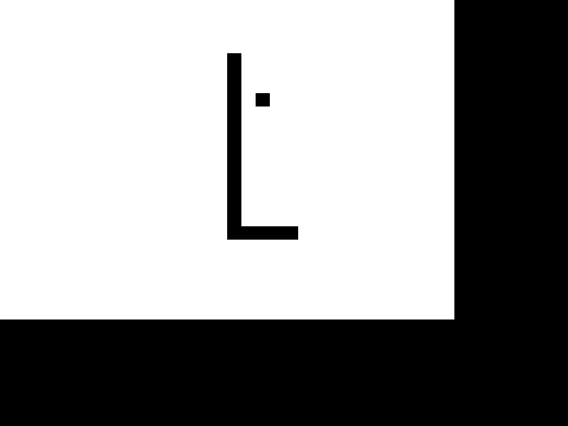

# ps2-samples
A safe place to store some PlayStation 2 sample code

## regDump
#### a program for printing register values to std out
```
+-----+----------------------------------------+
| $17 | 0x baadf00d deadbeef badc0ffe ecafebad |
+-----+----------------------------------------+
```
This program serves as a hello world type example to demonstrate assembly language usage.

## triangles
#### a program to render random triangles on the screen


##### TODO:
* add a makefile
* prevent triangle rendering from blocking controller input

## snake
#### an implementation of the classic snake game


##### TODO:
* add a makefile
* prevent rendering from blocking controller input. This is really apparent when the game is slowed down.
